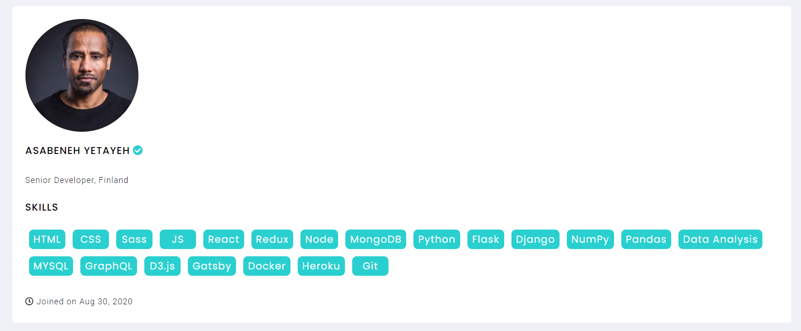

# Exercises: Components and Props

## Exercises: Level 1

1. What is props in a React component ?

Props é uma forma de passar dados a outro componente. Cada componente recebe parametros e possui um objeto que por convenção do react, se chama props.

2. How do you access props in a React component ?

É possivel acessar igual um objeto normal em javascript com props.title ou props['title'] e também via destructing.

3. What data types can we pass as props to components ?

Qualquer tipo de dado.

4. What is a propTypes?

5. What is a default propTypes?
   É uma forma de passar props types padrão(default) a um componente

## Exercises: Level 2

1. Create a functional component and display the following images
   

2. Use functional component to create the following design

## Exercises: Level 3

1.  Use the given hexadecimal color generator in the example to create these random colors. If you don't know how to generate the hexadecimal color you can use [dummy data generator](https://www.30daysofreact.com/dummy-data)

2. Use functional component to design the following user card.

🎉 CONGRATULATIONS ! 🎉
